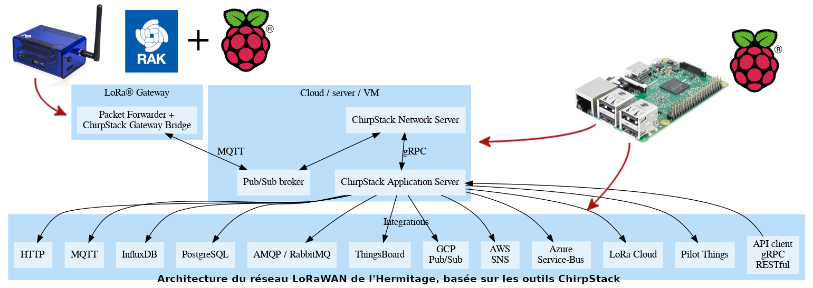
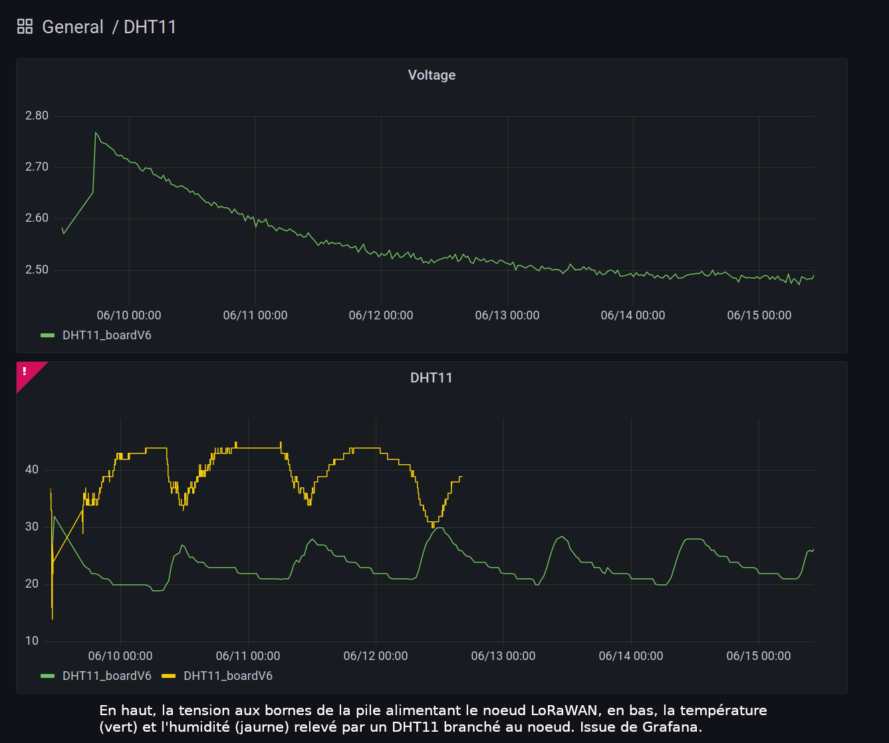

# LoRaWan x HER

Ce projet consistait en la création d’un réseau d’objet connecté en LoRaWan, dans le tiers lieu l'Hermitage, à partir de microcontrôleur Arduino Pro Mini. Le but était de trouver une méthode générale, non seulement pour installer un réseau LoRaWAN, mais également de développer une carte électronique (PCB) pour les noeuds LoRaWAN, ainsi que des programmes pour ces cartes. Ce travail se veut donc être une porte d'entrée pour les makers souhaitant s'investir dans le développement de réseaux IOT LoRaWAN libres !

Les plus grosses contributions de ce dossier sont la PCB développée (voir le dossier [board](./board)), ainsi que les programmes Arduino (voir le dossier [arduino_sketches](./arduino_sketches)), permettant de fabriquer son propre noeud LoRaWAN pour ~ 20€ (je n'ai pas trouvé d'autres solutions grand public permettant d'obtenir ce résultat). Quelques conseils sont également disponibles pour les personnes souhaitant construire leur propre réseau LoRaWAN.

Ce dossier n'est actuellement plus maintenu, j'espère qu'il servira de base de travail pour d'autres ! Merci à l’équipe de l’Hermitage et à l’association L’Hermitage Expérimentation pour l’opportunité de travailler sur ce projet au sein du pôle numérique et de son fablab.

## Documentations

* Pour les personnes souhaitant découvrir LoRa et LoRaWan, il y a le livre [LoRa - LoRaWAN et l'Internet des Objets]([https://www.univ-smb.fr/lorawan/wp-content/uploads/2022/01/Livre-LoRa-LoRaWAN-et-lInternet-des-Objets.pdf]), qui est en français, très pédagogique et accessible gratuitement en PDF.

* On trouve également beaucoup de documentation sur le protocole LoRaWan sur le site de TheThingNetwork : <https://www.thethingsnetwork.org/docs/lorawan/>.

* Tout un ensemble de cours nommé *LoRaWAN Academy*, ainsi que des tutos sont également accessibles à cette adresse : <https://lora-developers.semtech.com/>. Ce [tutoriel](https://lora-developers.semtech.com/learn/hands-on-labs/how-to-build-deploy-a-lorawan-network/how-to-build-deploy-a-lorawan-network-introduction) notamment, a été d'une grande aide pour l'installation d'un serveur local LoRaWAN sur Chirpstack.

* Pour des points techniques concernant le protocole, j'invite à se référer à [LoRaWAN Specification](https://lora-alliance.org/resource_hub/lorawan-specification-v1-0-3/), et [LoRaWAN Regional Parameters](https://lora-alliance.org/resource_hub/rp2-1-0-3-lorawan-regional-parameters/) concernant l'utilisation des fréquences par région.

## Architecture du réseau LoRaWAN de l'Hermitage

### Présentation de l’architecture réseau

#### 

Notre choix s’est porté sur la suite d'outils [Chirpstack](https://www.chirpstack.io/). Un premier RaspberryPi s’occupe de la partie passerelle, à l'aide de *ChirpStack Concentratord* et *ChirpStack Gateway Bridge*, un second fait office de serveur pour les services web : *ChirpStack Network Server*, *ChirpStack Application Server*, ainsi que les autres applications qui utilisent les données (*InfluxDB*, *Grafana*, *Home Assistant*...). Nous avons en effet choisis de dissocier la partie passerelle de la partie serveur, la passerelle peut ainsi être installé n'importe où, elle est autonome et n'héberge pas de services web. Il est tout à fait possible de tout installer sur un même RaspberryPi si ça ne vous pose pas de problème.

### Choix du matériel

Nous avons choisi de ne pas acheter directement une gateway LoRaWan "tout-intégrée", mais plutôt de combiner un module LoRa avec un Raspberry Pi, pour être plus libre sur le choix des programmes gérant la passerelle.

Un module LoRa utilisé pour les nœuds (SX1276 ou RFM95) n’est pas suffisant pour une gateway/passerelle. En effet, il est nécessaire de pouvoir recevoir et envoyer des paquets en parallèle à des nœuds, sur des fréquences différentes.
Il est tout de même possible de réaliser une passerelle avec un module LoRa destiné aux nœuds, mais dans ce cas, ce sera une passerelle "single-channel". Des limitations risquent donc d’apparaître quand plusieurs nœuds seront connectés au réseau LoRaWan en parallèle. Pour une telle installation, nous recommandons le travail de CongDucPham, [LowCostLoRaGw](https://github.com/CongducPham/LowCostLoRaGw). Cela peut être une bonne entrée en matière, sans se ruiner.
La plupart des modules LoRa pour gateway sont basés sur le *Semtech SX1308*. Une liste de matériel possible est disponible sur cette page : <https://www.chirpstack.io/concentratord/hardware-support/>.

Nous avons porté notre choix sur le [RAK7246G](https://github.com/CongducPham/LowCostLoRaGw) de chez RAK, qui est une solution assez peu onéreuse (~ 110€). Comportant un module *LoRa RAK2246*, un *RaspberryPi Zero W* (suffisamment puissant pour cette application), tout cela maintenu dans un boitier. Pour une solution plus opérationnelle, il faudrait changer le boitier pour quelque chose d’étanche et permettant de mettre la gateway en extérieur. Mais pour du prototypage, mettre cette gateway en intérieur est suffisant.

### Choix de l’OS de la gateway

Pour créer une passerelle à partir d’un RaspberryPi, il existe principalement 3 possibilités pour le programme :
* ChirpStack Concentratord
* Semtech UDP Packet Forwarder
* Basic Station Packet Forwarder

*Semtech UDP Packet Forwarder* n’est plus maintenu depuis plusieurs années, et possède des soucis de sécurité, il faut donc éviter de l’utiliser.

Notre choix s’est porté sur *ChirpStack Concentratord*. En effet, *Basic Station Packet Forwarder* utilise son propre protocole "LNS" pour l’échange de paquets (uplink ou downlink), alors que  *ChirpStack Concentratord* permet simplement de communiquer en UDP ou avec MQTT, qui sont des protocoles plus connus ; il est alors plus simple d’intégrer la gateway à une architecture réseau (il est même possible de développer un programme simple en Python qui intercepte les paquets MQTT, si une architecture simple suffit. Voir le travail de [CongDucPham](https://github.com/CongducPham/LowCostLoRaGw/tree/master/gw_full_latest)).

« ChirpStack Gateway OS » est un OS tout-en-un pour RaspberryPi, comprenant ChirpStack Concentratord et un bridge pour passer de UDP à MQTT (ainsi que ChirpStack Network Server et ChirpStack Application Server si on souhaite que la gateway s’occupe également de la partie serveur), permettant de configurer simplement la gateway au travers d’une CLI. Nous avons donc décidé d’utiliser ChirpStack Gateway OS avec notre RAK7246G.

### Sécurité du réseau

Plusieurs services web communiquent entre eux au sein du réseau, il est nécessaire de s’assurer qu’aucun autre service ne puisse communiquer sur les mêmes ports réseaux. Pour cela, le mieux est d’utiliser des certificats TLS. [Chirpstack-certificates](https://github.com/brocaar/chirpstack-certificates) est un utilitaire permettant de générer des certificats pour tous les éléments d’un réseau LoRaWan Chirpstack (mais cela devrait aussi pouvoir fonctionner pour autre chose que Chirpstack).

### Choix du network-server

Il existe principalement deux services possibles pour la partie web de LoRaWan : *Chirpstack* et *The Thing Network*. *Chirpstack* propose des solutions pour héberger ces propres services web, alors que *The Thing Network* est un cloud, permettant d’y connecter ses noeuds LoRa. Votre choix dépend donc de ce que vous souhaitez faire. À l’Hermitage nous souhaitions plutôt avoir un service auto-hébergé, nous nous sommes donc concentré sur *Chirpstack*.

### Utilisation des données par les applications

La couche MAC LoRaWAN étant gérée par *ChirpStack Network Server*, *ChirpStack Application Server* donne accès à une API, pour utiliser les données des capteurs dans tout type d’applications. Il existe déjà certaines intégrations, notamment avec *InfluxDB*, que nous avons choisi de combiner avec *Grafana* (nous avons utilisé ces conteneurs pour une installation rapide : <https://github.com/jkehres/docker-compose-influxdb-grafana>). Ainsi, les données des capteurs sont réceptionnées par la base de données InfluxDB, et Grafana permet de réaliser des dashboards à partir de cette BDD :

Il existe également une intégration avec MQTT, qui permet de réceptionner les uplinks, et de programmer des downlinks. Cette solution a un temps été envisagé pour commander des actionneurs (nœud de Classe C), grâce à Home Assistant (et donc avec l’intégration MQTT comme intermédiaire entre ChirpStack Network Server et Home Assistant).

Beaucoup de services différents existe en fonction de vos besoins, que ce soit pour de la simple visualisation de dashboards (capteurs), ou la création d’automatisation (actionneurs). Nous vous invitons donc à regarder les intégrations déjà disponibles dans ChirpStack Application Server, et s’il n’y a pas votre préféré, utilisez l’API !

## Portée à l'Hermitage

Quelques tests de portée ont pu être réalisés à l'Hermitage. Il est clair que la présence d'obstacle vient limiter la portée du signal LoRa : lorsque la gateway et le noeud sont séparés par des arbres, on perd plus de paquets (dû au feuillage, en hiver le problème serait bien moindre !). 
Il faut donc privilégier une visibilité directe entre la passerelle (gateway) et les noeuds (même un chemin de forêt, peut servir de "couloir" au signal et améliorer la portée).
Actuellement, la passerelle Lora de l'Hermitage se trouve dans un bâtiment en intérieur, et plutôt sur le flan d'une vallée. Avec une antenne placée à l'extérieur, sur le plateau de l'Hermitage, et éventuellement avec une antenne plus adaptée (une antenne omnidirectionnelle plutôt qu'une antenne hélicoïdale), on pourrait avoir un signal encore meilleur !
De plus, les tests ont été réalisés avec un spreading factor faible (de 7, le plus faible), notamment pour pouvoir envoyer plusieurs salves de paquets d'affilées lors des tests (pour ne pas être handicapé par le duty cycle). Quelques tests avec un SF=12 (le maximum) ont été fait, et montraient que la portée était bien meilleure malgré les obstacles. Avec un SF=12, on pourrait probablement couvrir tout le site de l'Hermitage sans problème !

### Protocole de test

Peu de tests ont pu être réalisés, mais le protocole de mesure est fonctionnel et peut être réutilisé !

Le noeud Arduino utilisait le programme OTAA_rangeTestBench : lorsqu'il y avait une interruption sur le pin 2 (entendre un appuie sur un interrupteur), 10 paquets étaient envoyés à la gateway, numéroté de 0 à 9, (avec un numéro supplémentaire d'identification de la salve de paquets).

Le but du test est donc d'envoyer une salve de paquet depuis une certaine position, et de voir ensuite le nombre de paquets correctement reçu parmi les 10. Il est également possible de s'intéresser au RSSI (indice de puissance d'un paquet) ou au SNR (ratio signal sur bruit), mais c'est plus difficile d'extraire de l'information.

Les résultats d'une série de tests pour deux PCBs différentes sont visualisables sur ces [cartes](./cartesMesures_testsPorteeHer.pdf). Les résultats sont également accessibles dans les tableurs [mesures_testPorteeHer_2022-06-15.ods](./mesures_testPorteeHer_2022-06-17.ods) et [mesures_testPorteeHer_2022-06-17.ods](./mesures_testPorteeHer_2022-06-17.ods). Les données ont été extraites d'une base de données InfluxDB, intégrée à ChirpStack.

## License

The content of this project is licensed under the Creative Commons Zero v1.0 Universal license, and the source code provided for arduino platform (in arduino_sketches directory) is licensed under the GNU General Public License v3.0.
